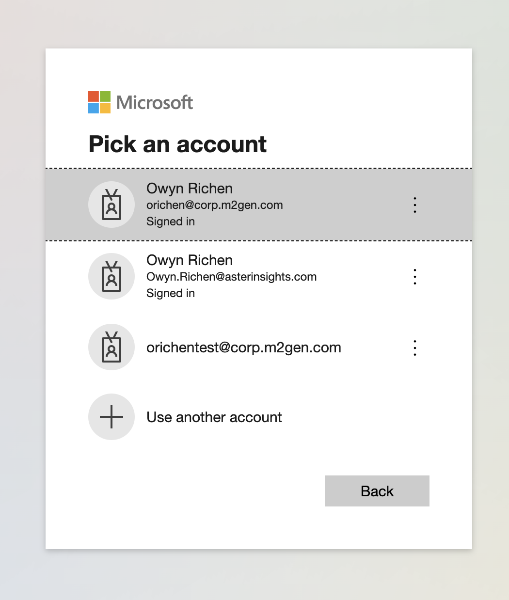

# Support Scripts that Leverage the RWB CLI

In this folder are support scripts that help folks leverage the RWB CLI for common tasks.

## Download a Project

The ```download_project.py``` is a python3 script that fetches all the file-ids and paths for
a given Aster Data Access project and downloads them sequentially.  Here's how to use it.

### Download RWB CLI

The latest RWB CLI release is hosted on github. [https://github.com/AsterInsights/rwb/releases](https://github.com/AsterInsights/rwb/releases).  Download the executable for your OS.

***NOTE:*** The executables for OSX and Windows will complain because they're non-verified by Apple and Microsoft
This is expected.

### Login Using the RWB CLI

These examples use the OSX version of the binary, but it will work similarly by swapping out the binary name.

The first time you run any rwb command, it'll bring up a browser and redirect you to login:

```bash
./rwb.osx.x64 project list
```

Be sure to use the ```@corp.m2gen.com``` account, as that is the one that is assocated with data projects.




## Get Your Project ID

This is easiest if you have [jq](https://jqlang.github.io/jq/) which helps command line tools parse JSON.

```bash
./rwb.osx.x64 project list | jq ' .projectAccess | .[] | select(.projectName |  match("Gillis"))'
```

This will return the JSON object of the project, i.e.:

```json
{
  "projectId": "d6f3416e-d56f-41c4-b3eb-b084014b30d4",
  "projectName": "23PRJ127MCC_Gillis",
  "userRole": "VIEW",
  "folderId": "260270bb-623a-440d-90d7-b084014b30d4"
}
```

## Dry-Run Your Download

Before downloading everything, you should dry-run your download to validate the script works. This is done
by default in the script.

It takes the following parameters:
* ```--project-id```: The ID of the project you fetched above
* ```--exec```: The fully-qualified path to the RWB CLI executable
* ```--destination-path```: OPTIONAL - The fully-qualified root directory you want the project to be delivered to. Defaults to your current working directory.
* ```--verbose``` : Adds additional output to help diagnose issues
* ```--no-dry-run```: Add this when you're ready to download
* ```--include```: Only include given folders to download, for example ```--include /Clinical_Data```.
* ```--exclude```: Exclude folders when downloading, for example ```--exclude /WES /RNAseq```.

```bash
python3 download_project.py --project-id d6f3416e-d56f-41c4-b3eb-b084014b30d4 --exec ./rwb.osx.x64 --destination-path ~/download-test
```

It'll print a ton of stuff, but here's a summarized example:

```bash
Downloading project (d6f3416e-d56f-41c4-b3eb-b084014b30d4) using ./rwb.osx.x64 with verbose=False, dry-run=True and destination path /Users/owynrichen/download-test
Reading folder 260270bb-623a-440d-90d7-b084014b30d4 (/)
Reading folder db34d79e-8ad1-4ca2-9902-b084015a7b6d (/Clinical_Data)
Reading folder 71f43516-e8db-4dac-95b0-b084015a8e6b (/Manifest_and_QC_Files)
Reading folder a1b6ac04-4025-4728-a0db-b084015a8f4c (/RNAseq)
Reading folder ad6499dc-e170-4e34-a9a1-b084015a9051 (/WES)
Reading folder db34d79e-8ad1-4ca2-9902-b084015a7b6d (/Clinical_Data)
Reading folder 71f43516-e8db-4dac-95b0-b084015a8e6b (/Manifest_and_QC_Files)
Reading folder a1b6ac04-4025-4728-a0db-b084015a8f4c (/RNAseq)
Reading folder ad6499dc-e170-4e34-a9a1-b084015a9051 (/WES)

...

Would download file /WES/tumor_vcfs/SL605546_st_t_markdup_recalibrated_Haplotyper.vcf.gz to /Users/owynrichen/Documents/code/m2gen/download-test/WES/tumor_vcfs/SL605546_st_t_markdup_recalibrated_Haplotyper.vcf.gz - dry-run enabled
Would download file /WES/tumor_vcfs/SL605546_st_t_markdup_recalibrated_Haplotyper.vcf.gz.md5 to /Users/owynrichen/Documents/code/m2gen/download-test/WES/tumor_vcfs/SL605546_st_t_markdup_recalibrated_Haplotyper.vcf.gz.md5 - dry-run enabled
Would download file /WES/tumor_vcfs/SL605546_st_t_markdup_recalibrated_Haplotyper.vcf.gz.tbi to /Users/owynrichen/Documents/code/m2gen/download-test/WES/tumor_vcfs/SL605546_st_t_markdup_recalibrated_Haplotyper.vcf.gz.tbi - dry-run enabled
Would download file /WES/tumor_vcfs/SL605547_st_t_markdup_recalibrated_Haplotyper.vcf.gz to /Users/owynrichen/Documents/code/m2gen/download-test/WES/tumor_vcfs/SL605547_st_t_markdup_recalibrated_Haplotyper.vcf.gz - dry-run enabled
Would download file /WES/tumor_vcfs/SL605547_st_t_markdup_recalibrated_Haplotyper.vcf.gz.md5 to /Users/owynrichen/Documents/code/m2gen/download-test/WES/tumor_vcfs/SL605547_st_t_markdup_recalibrated_Haplotyper.vcf.gz.md5 - dry-run enabled
Would download file /WES/tumor_vcfs/SL605547_st_t_markdup_recalibrated_Haplotyper.vcf.gz.tbi to /Users/owynrichen/Documents/code/m2gen/download-test/WES/tumor_vcfs/SL605547_st_t_markdup_recalibrated_Haplotyper.vcf.gz.tbi - dry-run enabled
Total Files: 1,312,883
Total Size: 346,063.81 GB
```

## Once All Is Good - DOWNLOAD!

Once you've validated the dry-run looks right, re-run the script with ```--no-dry-run``` and it'll
go through the work to prep the download but will begin to fetch.

```bash
python3 download_project.py --project-id d6f3416e-d56f-41c4-b3eb-b084014b30d4 --exec ./rwb.osx.x64 --destination-path ~/Documents/code/m2gen/download-test --no-dry-run
```